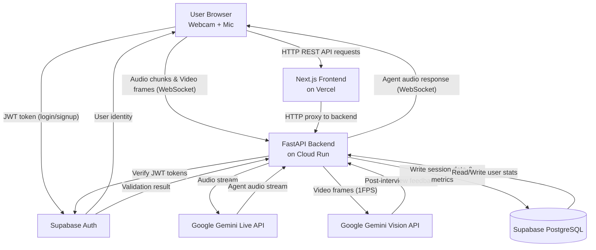

# System Architecture

```mermaid
graph TD
    %% Nodes
    Browser[User Browser<br>Webcam + Mic]
    Frontend[Next.js Frontend<br>on Vercel]
    FastAPI[FastAPI Backend<br>on Cloud Run]
    GeminiLive[Google Gemini Live API]
    GeminiVision[Google Gemini Vision API]
    SupabaseAuth[Supabase Auth]
    SupabaseDB[(Supabase PostgreSQL)]

    %% Data flows
    Browser -- "Audio chunks & Video frames (WebSocket)" --> FastAPI
    FastAPI -- "Agent audio response (WebSocket)" --> Browser
    
    Browser -- "HTTP REST API requests" --> Frontend
    Frontend -- "HTTP proxy to backend" --> FastAPI
    
    Browser -- "JWT token (login/signup)" --> SupabaseAuth
    FastAPI -- "Verify JWT tokens" --> SupabaseAuth
    SupabaseAuth -- "User identity" --> Browser
    SupabaseAuth -- "Validation result" --> FastAPI

    FastAPI -- "Audio stream" --> GeminiLive
    GeminiLive -- "Agent audio stream" --> FastAPI
    
    FastAPI -- "Video frames (1FPS)" --> GeminiVision
    GeminiVision -- "Post-interview feedback" --> FastAPI
    
    FastAPI -- "Write session data & metrics" --> SupabaseDB
    SupabaseDB -- "Read/Write user stats" --> FastAPI
```
